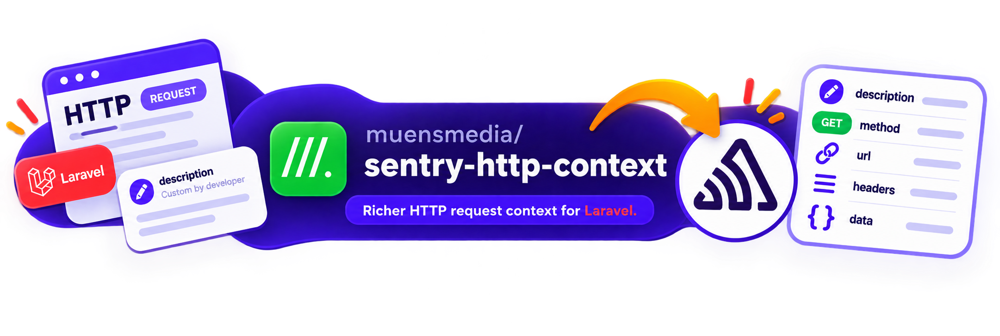
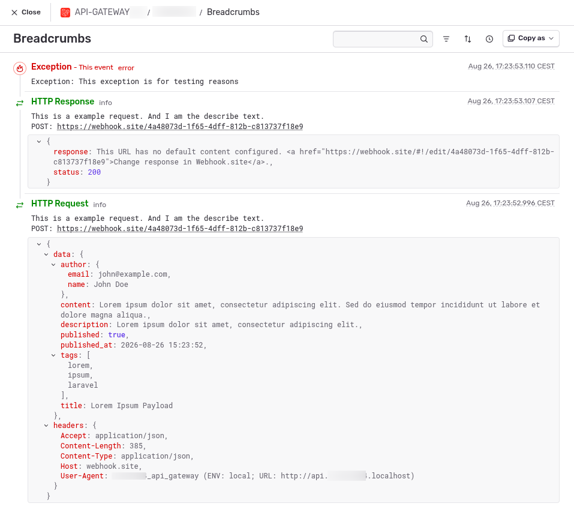

<div align="center">



# Sentry HTTP Context

**A [MÜNSMEDIA](https://muensmedia.de) project.**

This repo is **not affiliated with, endorsed by, or maintained by Sentry.**

</div>

Laravel's HTTP client tells Sentry *that* an outgoing request happened. It does
not tell you what was in it. This package adds the full request and response
context to your Sentry breadcrumb trail: HTTP method, URL, headers with
credentials masked, the JSON request payload you sent and the decoded JSON
response body you got back, the status code, and the reason a call failed
outright. Every `Http::get()`, `Http::post()` and every other Laravel HTTP
client call is covered, including calls made from inside third-party packages.

So when an exception lands in Sentry, the API call that caused it is already
sitting next to the stack trace — decoded, readable, and in order — instead of
being a URL you have to reproduce locally. Installation is a `composer require`:
the service provider is auto-discovered, it registers a single Guzzle
middleware, and no call site in your application changes. Optionally label a
call with `Http::describe('Sync customer to CRM')` so its breadcrumbs read as
your own words rather than a bare URL.

## Requirements

- PHP 8.2 – 8.5
- Laravel 11 or 12
- [`sentry/sentry-laravel`](https://github.com/getsentry/sentry-laravel) 4.27+,
  already set up in your application

## Installation

```bash
composer require muensmedia/sentry-http-context
```

That is it. The service provider is auto-discovered and hooks into Laravel's
HTTP client globally. **Your existing `Http::get()` and `Http::post()` calls keep
working unchanged.**

The call behind the screenshot below, with the payload cut short:

```php
Http::describe('This is a example request. And I am the describe text.')
    ->post('https://webhook.site/…', [
        'title' => 'Lorem Ipsum Payload',
        'description' => 'Lorem ipsum dolor sit amet, consectetur adipiscing elit.',
        'author' => [
            'name' => 'John Doe',
            'email' => 'john@example.com',
        ],
        // ...
    ]);

report(new Exception('This exception is for testing reasons'));
```

<div align="center">



</div>

| Category | Level | Metadata |
| --- | --- | --- |
| `HTTP Request` | `info` | `method`, `url`, `headers` (credentials masked), `data` |
| `HTTP Response` | `info`, `warning` from 4xx up | `method`, `url`, `status`, `response` |
| `HTTP Failure` | `error` | `method`, `url`, `reason` |

`data` and `response` are the decoded body where Laravel can decode it, a
truncated string otherwise. `describe()` is optional, see
[Labelling a request](#labelling-a-request).

Under the hood this is one Guzzle middleware on `Http::globalMiddleware()` plus
defaults on `Http::globalOptions()`. Laravel's `Factory` is not replaced, so
`Http::fake()` and everything else keeps working.

## Labelling a request

Breadcrumbs are unlabelled by default: you see `HTTP Request` and a URL.
`describe()` puts your own words there instead, on the message line you can see
in the screenshot above.

```php
Http::withToken($token)
    ->describe('Sync customer to CRM')
    ->post($url, $payload);
```

Both breadcrumbs of the call get the label. It is a macro on `PendingRequest`, so
it chains anywhere, applies to that one request only, and travels as a Guzzle
option rather than a header, so it never leaves your application.

## Presets

Every pending request gets a few defaults, which anything you set on the request
itself overrides:

- `User-Agent`, derived from the application: `MyApp (ENV: production; URL: https://myapp.test)`
- `Accept: application/json`
- `timeout: 60`

Turn the set off with `SENTRY_HTTP_CONTEXT_PRESETS=false`.

### Changing the user agent

A fixed string goes in your `.env`:

```dotenv
SENTRY_HTTP_CONTEXT_USER_AGENT="Acme/1.0"
```

Anything that has to be computed goes in a service provider:

```php
namespace App\Providers;

use Illuminate\Support\ServiceProvider;
use Muensmedia\SentryHttpContext\SentryHttpContext;

class AppServiceProvider extends ServiceProvider
{
    public function boot(): void
    {
        SentryHttpContext::useUserAgent(fn () => 'Acme/'.config('app.version'));
    }
}
```

The closure runs per request, so it may read config or the environment, and boot
order does not matter. It beats the config value, which beats the derived
default. Pass `null` (or set the config to `false`) to send no user agent at all.

## Configuration

```bash
php artisan vendor:publish --tag=sentry-http-context-config
```

| Key | Default | Env | |
| --- | --- | --- | --- |
| `breadcrumbs.enabled` | `true` | `SENTRY_HTTP_CONTEXT_BREADCRUMBS` | record breadcrumbs at all |
| `breadcrumbs.max_body_length` | `4096` | `SENTRY_HTTP_CONTEXT_MAX_BODY_LENGTH` | hard cap for bodies that cannot be decoded |
| `breadcrumbs.redacted_headers` | `authorization`, `proxy-authorization`, `cookie`, `x-api-key`, `x-auth-token` | — | masked as `[redacted]`, case-insensitive |
| `presets.enabled` | `true` | `SENTRY_HTTP_CONTEXT_PRESETS` | apply the defaults above |
| `presets.user_agent` | `null` | `SENTRY_HTTP_CONTEXT_USER_AGENT` | `null` = derive it, `false` = send none |
| `presets.accept_json` | `true` | — | send `Accept: application/json` |
| `presets.timeout` | `60` | — | seconds |
| `replace_sentry_breadcrumbs` | `true` | — | see below |

Redaction touches the breadcrumb only, never the outgoing request. **Response
bodies are not redacted.** If an endpoint returns secrets, turn breadcrumbs off
for that part of your application.

`sentry-laravel` writes its own, leaner breadcrumb per response;
`replace_sentry_breadcrumbs` disables those so nothing shows up twice. Its
distributed tracing is untouched: `sentry-trace` and `baggage` are still
attached by `sentry-laravel` itself.

## Testing

```bash
composer test
```

There is no committed lock file, so each PHP version resolves its own dependency
set (8.2 gets Pest 3, the rest Pest 4). That also means `vendor/` is not portable
between versions and has to be rebuilt when you switch:

```bash
docker run --rm -v "$(pwd)":/var/www/html -w /var/www/html wodby/php:8.2 \
    sh -c 'rm -rf vendor composer.lock && composer update --no-interaction && vendor/bin/pest'
```

Swap `8.2` for `8.3`, `8.4` or `8.5`; append `bash` with `-it` instead of `sh -c`
for a shell. The directory is mounted, so this overwrites your local `vendor/`.
Run the version you develop on last. `composer install` will not work: a lock
file from another version fails outright, since the 8.5 set needs PHP >= 8.4.

CI runs the same, once per version, plus `pint --test`.

## About

Built and maintained by [MÜNSMEDIA](https://muensmedia.de).

An independent, unofficial package. It is **not affiliated with, endorsed by, or
maintained by Sentry**, and not a Sentry product. It builds on the official
[`sentry/sentry-laravel`](https://github.com/getsentry/sentry-laravel) SDK, which
is untouched by this package and subject to its own licence. "Sentry" is a
trademark of its respective owner, used here only to describe what this package
integrates with.

## License

MIT. See [LICENSE](LICENSE).
